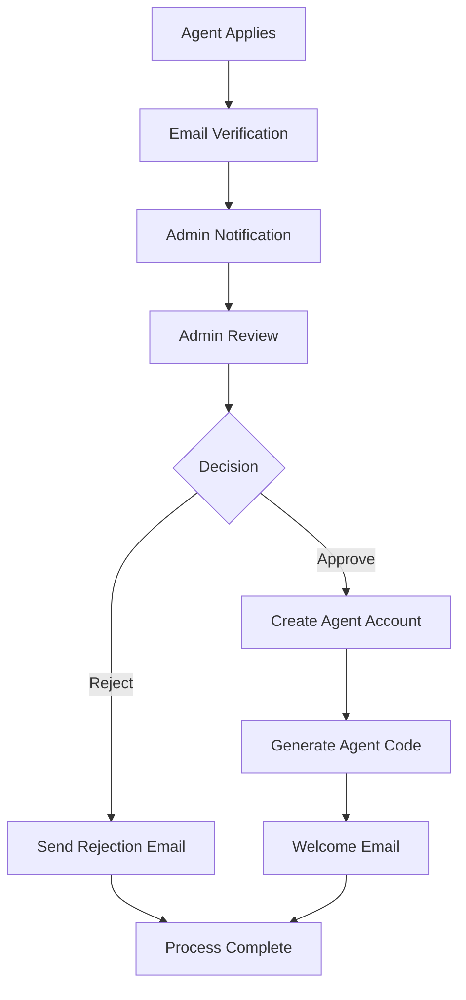

# 🚀 Scalable Admin Dashboard Architecture
## Nandighosh Bus Service - Complete Agent Registration Management System

### 📋 **System Overview**

The Admin Dashboard is a comprehensive management interface that provides administrators with complete control over agent registrations, user management, and system operations. Built with scalability, security, and user experience in mind.

---

## 🏗️ **Architecture Components**

### **1. Frontend Architecture**

#### **Core Components**
```
components/
├── admin/
│   ├── AdminDashboardAgentRegistrations.tsx    # Agent management interface
│   ├── AdminDashboardStats.tsx                 # Dashboard statistics
│   ├── AdminNotificationCenter.tsx             # Notification management
│   └── AdminUserManagement.tsx                 # User administration
├── pages/
│   └── AdminDashboard.tsx                      # Main dashboard layout
└── ui/
    ├── data-table.tsx                          # Reusable data tables
    ├── notification-badge.tsx                  # Real-time notifications
    └── status-indicators.tsx                   # System status displays
```

#### **Key Features**
- **Real-time Updates**: WebSocket integration for live agent registration notifications
- **Role-Based Access Control**: Granular permissions for different admin levels
- **Responsive Design**: Mobile-optimized interface for on-the-go management
- **Advanced Filtering**: Multi-criteria search and filtering capabilities
- **Bulk Operations**: Mass approve/reject functionality for efficiency

### **2. Backend Architecture**

#### **API Structure**
```
backend/src/routes/
├── adminRoutes.js                 # Core admin endpoints
├── agentRegistration.js           # Agent registration workflow
└── adminNotifications.js          # Notification system
```

#### **Database Schema**
```sql
-- Core Tables
agent_registrations     # Pending registration requests
agents                  # Approved agent records
notifications          # System notifications
admin_actions          # Audit trail
user_profiles          # User management
```

---

## 🔐 **Security & Authentication**

### **Multi-Layer Security**
1. **JWT Authentication**: Secure token-based authentication
2. **Role-Based Authorization**: `admin`, `super_admin` role validation
3. **Request Validation**: Input sanitization and validation
4. **Audit Logging**: Complete admin action tracking
5. **Rate Limiting**: API endpoint protection
6. **Session Management**: Secure session handling

### **Permission Matrix**
| Action | Admin | Super Admin |
|--------|-------|-------------|
| View Registrations | ✅ | ✅ |
| Approve/Reject | ✅ | ✅ |
| System Settings | ❌ | ✅ |
| User Management | ❌ | ✅ |
| Audit Logs | ✅ | ✅ |

---

## 📊 **Agent Registration Workflow**

### **Registration Process**


### **Status Tracking**
- **Pending**: Initial application submitted
- **Email Verification**: Waiting for email confirmation
- **Under Review**: Admin actively reviewing
- **Approved**: Registration approved, agent activated
- **Rejected**: Registration rejected with reason

---

## 🎛️ **Dashboard Features**

### **Main Dashboard Overview**
```typescript
interface DashboardStats {
  totalAgents: number;           // Active agents count
  pendingRegistrations: number;  // Awaiting approval
  totalBookings: number;         // System bookings
  totalRevenue: number;          // Revenue metrics
  activeRoutes: number;          // Operating routes
  activeBuses: number;           // Fleet status
}
```

### **Agent Registration Management**
- **📋 Registration List**: Paginated table with filtering
- **🔍 Detailed View**: Complete applicant information
- **✅ Quick Actions**: One-click approve/reject
- **📝 Admin Notes**: Add review comments
- **📧 Email Integration**: Automated notifications
- **📈 Statistics**: Registration trends and metrics

### **Advanced Features**
- **Real-time Notifications**: Instant alerts for new registrations
- **Bulk Operations**: Process multiple applications simultaneously
- **Export Functionality**: Download registration data
- **Advanced Search**: Multi-field search and filtering
- **Audit Trail**: Complete action history

---

## 🔧 **API Endpoints**

### **Agent Registration APIs**
```javascript
// Core Registration Endpoints
POST   /api/v1/agents/register          # Submit application
POST   /api/v1/agents/verify-email      # Email verification
GET    /api/v1/agents/registration-status/:id  # Check status

// Admin Management Endpoints
GET    /api/v1/agents/pending           # List pending registrations
GET    /api/v1/agents/registration/:id  # Get detailed view
POST   /api/v1/agents/approve/:id       # Approve registration
POST   /api/v1/agents/reject/:id        # Reject registration

// Dashboard & Analytics
GET    /api/v1/admin/dashboard-stats    # Dashboard statistics
GET    /api/v1/admin/recent-activity    # Recent system activity
GET    /api/v1/admin/system-health      # System status
```

### **Response Formats**
```typescript
// Registration List Response
interface RegistrationListResponse {
  registrations: AgentRegistration[];
  total: number;
  page: number;
  limit: number;
  totalPages: number;
}

// Registration Details Response
interface RegistrationDetailsResponse {
  registration: AgentRegistration;
  documents?: Document[];
  history?: ActionHistory[];
}
```

---

## 📱 **User Experience Features**

### **Responsive Design**
- **Desktop**: Full-featured dashboard interface
- **Tablet**: Optimized layout for touch interaction
- **Mobile**: Essential features with simplified UI

### **Accessibility**
- **WCAG 2.1 Compliance**: Full accessibility standards
- **Keyboard Navigation**: Complete keyboard support
- **Screen Reader Support**: ARIA labels and descriptions
- **High Contrast Mode**: Enhanced visibility options

### **Performance Optimization**
- **Lazy Loading**: Efficient data loading
- **Caching**: Strategic data caching
- **Pagination**: Scalable data display
- **Search Optimization**: Fast search algorithms

---

## 🚀 **Scalability Features**

### **Database Optimization**
- **Indexed Queries**: Optimized database performance
- **Connection Pooling**: Efficient database connections
- **Query Optimization**: Minimized database load
- **Backup Strategies**: Data protection and recovery

### **Performance Monitoring**
- **Real-time Metrics**: System performance tracking
- **Error Monitoring**: Proactive issue detection
- **User Analytics**: Usage pattern analysis
- **Resource Monitoring**: Server resource tracking

### **Deployment Architecture**
```
Load Balancer
    ├── Frontend (React/Next.js)
    ├── API Gateway
    ├── Backend Services
    │   ├── Authentication Service
    │   ├── Agent Registration Service
    │   └── Notification Service
    └── Database Cluster
        ├── Primary Database
        └── Read Replicas
```

---

## 📊 **Analytics & Reporting**

### **Registration Metrics**
- **Application Volume**: Daily/weekly/monthly trends
- **Approval Rates**: Success/rejection statistics
- **Processing Time**: Average review duration
- **Geographic Distribution**: Registration by location
- **Experience Levels**: Agent experience analytics

### **Admin Performance**
- **Review Efficiency**: Admin processing speeds
- **Decision Patterns**: Approval/rejection trends
- **Response Times**: System performance metrics
- **User Satisfaction**: Feedback and ratings

---

## 🔄 **Integration Capabilities**

### **Email System Integration**
- **SMTP Configuration**: Flexible email providers
- **Template Management**: Customizable email templates
- **Delivery Tracking**: Email delivery confirmation
- **Bounce Handling**: Failed delivery management

### **Third-party Integrations**
- **SMS Gateway**: Multi-channel notifications
- **Document Verification**: ID verification services
- **Payment Processing**: Commission and fee handling
- **Analytics Tools**: Business intelligence integration

---

## 🛠️ **Development Guidelines**

### **Code Structure**
```typescript
// Component Structure
interface AdminDashboardProps {
  userRole: 'admin' | 'super_admin';
  permissions: Permission[];
}

// Service Layer
class AdminService {
  async getRegistrations(filters: RegistrationFilters): Promise<RegistrationList>;
  async approveRegistration(id: string, notes: string): Promise<ApprovalResult>;
  async rejectRegistration(id: string, reason: string): Promise<RejectionResult>;
}

// Data Layer
interface RegistrationRepository {
  findPending(): Promise<AgentRegistration[]>;
  updateStatus(id: string, status: RegistrationStatus): Promise<void>;
  createAuditLog(action: AdminAction): Promise<void>;
}
```

### **Testing Strategy**
- **Unit Tests**: Component and function testing
- **Integration Tests**: API endpoint validation
- **E2E Tests**: Complete workflow testing
- **Performance Tests**: Load and stress testing

---

## 📈 **Future Enhancements**

### **Planned Features**
- **AI-Powered Screening**: Automated initial review
- **Video Interview Integration**: Remote interview capabilities
- **Document Scanner**: OCR document processing
- **Multi-language Support**: International expansion
- **Mobile Admin App**: Native mobile administration

### **Advanced Analytics**
- **Predictive Analytics**: Registration success prediction
- **Machine Learning**: Pattern recognition for fraud detection
- **Business Intelligence**: Advanced reporting dashboards
- **Real-time Dashboard**: Live system monitoring

---

## ✅ **Implementation Status**

### **Completed Features** ✅
- ✅ Basic admin dashboard structure
- ✅ Agent registration API endpoints
- ✅ Email notification system
- ✅ Database schema and relationships
- ✅ Authentication and authorization
- ✅ Basic UI components and layouts
- ✅ Registration workflow implementation

### **In Progress** 🔄
- 🔄 Advanced filtering and search
- 🔄 Real-time notifications
- 🔄 Bulk operations functionality
- 🔄 Enhanced analytics dashboard

### **Planned** 📋
- 📋 Mobile responsive optimizations
- 📋 Advanced reporting features
- 📋 Integration with external services
- 📋 Performance optimization
- 📋 Advanced security features

---

## 🚀 **Deployment Instructions**

### **Environment Setup**
1. **Database Schema**: Run `06-agent-registration-system.sql`
2. **Environment Variables**: Configure SMTP, JWT, and database settings
3. **Dependencies**: Install all required packages
4. **Build Process**: Compile TypeScript and React components

### **Configuration**
```env
# Admin Dashboard Configuration
ADMIN_DASHBOARD_ENABLED=true
ADMIN_SESSION_TIMEOUT=3600
ADMIN_RATE_LIMIT=100
NOTIFICATION_REALTIME=true
EMAIL_NOTIFICATIONS=true
```

---

This scalable admin dashboard architecture provides a robust foundation for managing agent registrations while ensuring security, performance, and user experience excellence. The modular design allows for easy expansion and maintenance as the system grows.
